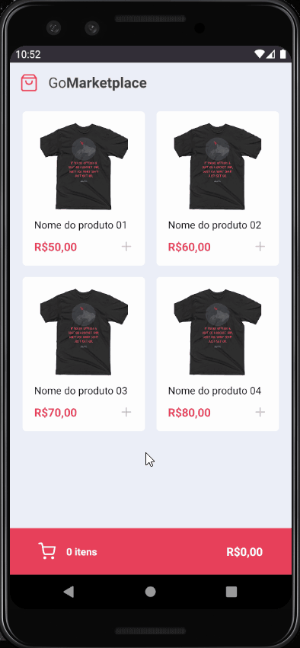

# GoMarketplace
A React Native app to control a market cart. In that app, I'm using a fake json api to provide the items. The main objective in using a fake api is to simplify the app and focus on cart development.

Technologies like typescript, async storage and context api are used. The cart is a context that is shared between all the routes.

GoMarketplace runs in Android and IOS phones. To use the app, first you need to start the api to provide the items and then you can start the emulator. See [running](#Running) section to get the commands.

**TIP:** With android emulator, it's necessary set ip address on [api file](src/services/api.ts), [package.json file](package.json).

The app is part of Rocketseat bootcamp.

## Main Techs
- Typescript
- Eslint
- Prettier
- Editor Config
- Axios
- Styled Components
- Context API
- Async Storage

## Running
- Install all the dependencies: `yarn`
- Run json api to android: `yarn start:api:android`
- Run json api to ios: `yarn start:api:ios`
- Run emulator to android: `yarn android`
- Run emulator to ios: `yarn ios`

---
Desenvolvido com :purple_heart: por [Marcelo Palmieri](https://www.linkedin.com/in/marcelo-palmieri)
